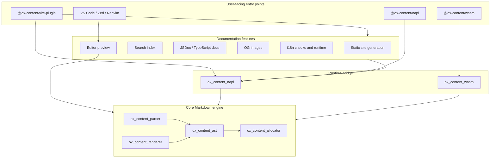
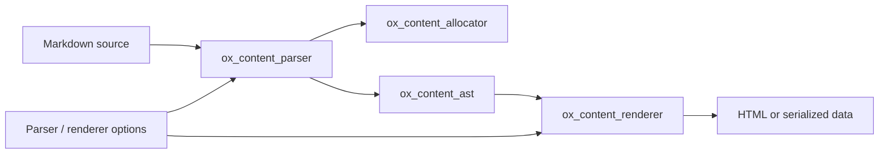
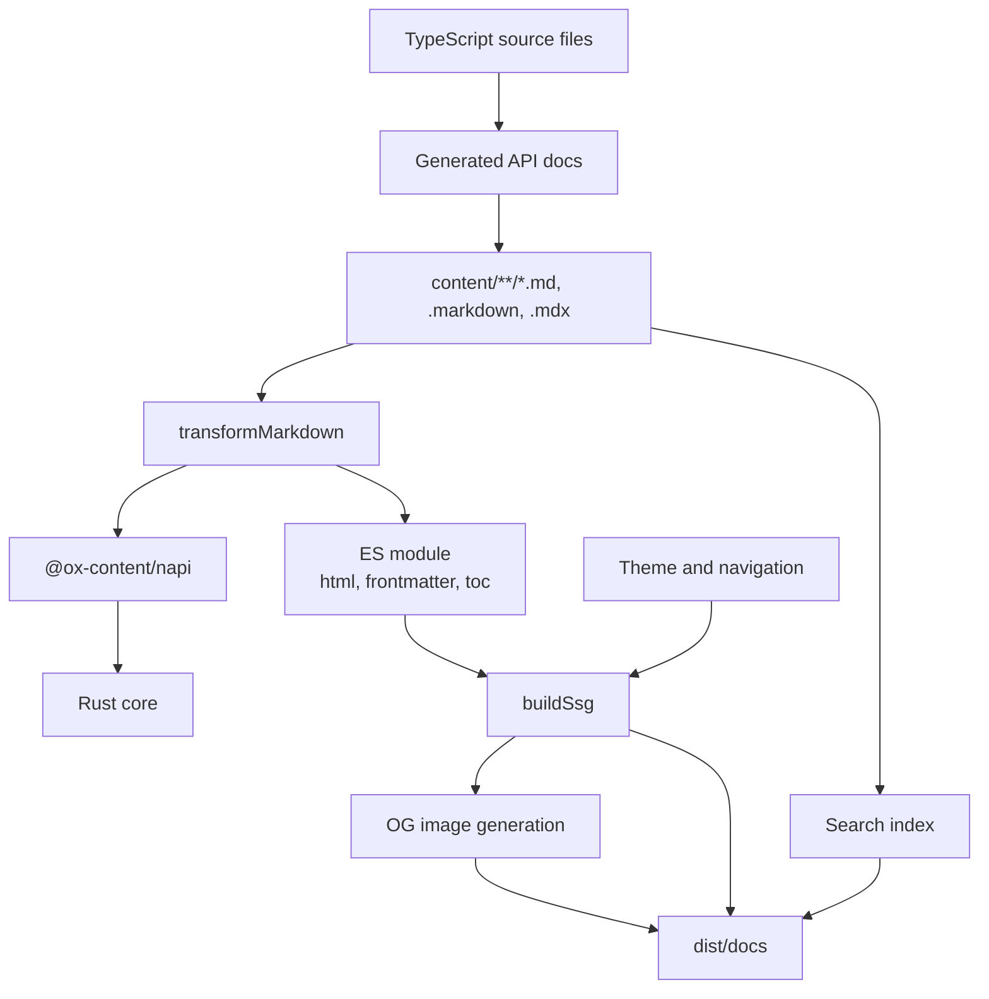
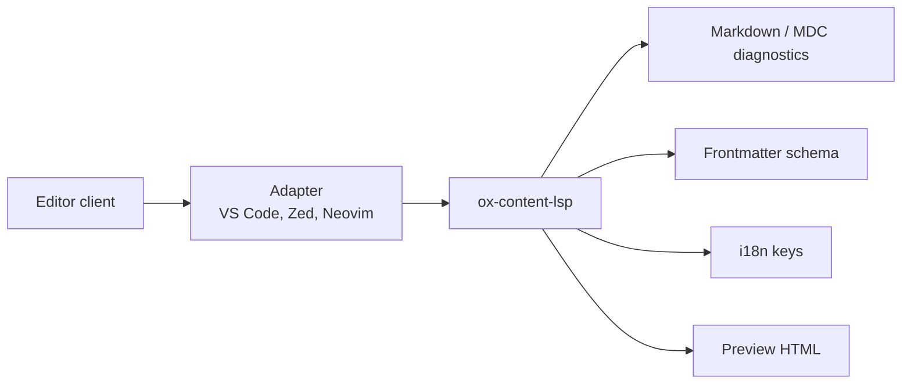

# Architecture

Ox Content is a Rust-powered documentation system and Markdown toolkit. The
core engine is small: parse Markdown into an arena-allocated AST, then render or
serialize it. The rest of the repository packages that engine for Vite, Node.js,
WebAssembly, generated API docs, search, OG images, i18n, and editor tooling.

This page is the map. It intentionally avoids API reference details and
performance results so the major boundaries stay visible.

## Current Shape

Ox Content has three layers:

1. **Core Markdown engine**: Rust crates for allocation, AST nodes, parsing, and
   rendering.
2. **Product features**: Rust and TypeScript modules for SSG, search, generated
   API docs, embeds, OG images, i18n checks, and editor previews.
3. **Distribution surfaces**: npm packages, N-API bindings, WebAssembly, Vite
   plugins, framework integrations, and editor adapters.

The important distinction is that the parser is not the whole product. It is the
lowest layer used by the docs site, package APIs, authoring tools, and checks.

## Entry Points

| Entry point                      | Use it for                                                                         | Primary implementation                           |
| -------------------------------- | ---------------------------------------------------------------------------------- | ------------------------------------------------ |
| `@ox-content/vite-plugin`        | Docs sites, Markdown transforms, SSG, theme, search, OG images, generated API docs | TypeScript orchestration plus `@ox-content/napi` |
| `@ox-content/napi`               | Node.js scripts, custom tools, direct parse/render/search/docs APIs                | `crates/ox_content_napi`                         |
| `@ox-content/wasm`               | Browser, Web Worker, or sandboxed JavaScript hosts                                 | `crates/ox_content_wasm`                         |
| `@ox-content/vite-plugin-vue`    | Vue component islands in Markdown                                                  | Base Vite plugin plus Vue runtime                |
| `@ox-content/vite-plugin-react`  | React component islands in Markdown                                                | Base Vite plugin plus React runtime              |
| `@ox-content/vite-plugin-svelte` | Svelte component islands in Markdown                                               | Base Vite plugin plus Svelte runtime             |
| `@ox-content/unplugin`           | Non-Vite bundlers such as Rollup, webpack, or esbuild                              | Universal plugin wrapper                         |
| Editor integrations              | Completion, diagnostics, snippets, preview, i18n authoring                         | `ox-content-lsp` plus editor adapters            |

For most documentation projects, start with the Vite plugin. It already depends
on the native package it needs, so `@ox-content/napi` is usually only installed
directly when you are building a custom Node.js tool.

## Markdown Engine

The core Markdown path is deliberately narrow.

Key properties:

- Each parse operation owns an `Allocator`, usually sized from the input length.
- AST nodes borrow from the source text and arena, which keeps parsing fast and
  avoids unnecessary string copies.
- Rendering produces owned output such as HTML, JSON data, or JavaScript module
  code before crossing into Node.js, WebAssembly, or a browser.
- Parser options control GFM, footnotes, tables, task lists, strikethrough,
  autolinks, and nesting limits.
- Renderer options add documentation-site behavior such as `.md` link
  conversion, base URLs, line annotations, code block metadata, and TOC depth.

## Vite And SSG Pipeline

The Vite plugin is the main product surface. It turns Markdown-like files into
importable modules during development and into static HTML during build.

During dev, Markdown imports are transformed to modules and HMR sends
`ox-content:update` events for changed files. During build, the SSG step collects
Markdown files, resolves routes, builds navigation, generates HTML pages, writes
the search index, and optionally generates per-page OG images.

The docs generator is part of the same build graph: it extracts TypeScript/JSDoc
metadata and writes Markdown files under the configured docs output directory
before the site build consumes them.

## Rust Crates

| Layer            | Crates                                                                               | Responsibility                                                          |
| ---------------- | ------------------------------------------------------------------------------------ | ----------------------------------------------------------------------- |
| Core Markdown    | `ox_content_allocator`, `ox_content_ast`, `ox_content_parser`, `ox_content_renderer` | Parse and render Markdown with arena-backed data structures             |
| Runtime bridges  | `ox_content_napi`, `ox_content_wasm`, `ox_content_vite`                              | Expose the core to Node.js, WebAssembly, and Vite-oriented runtime code |
| Site features    | `ox_content_ssg`, `ox_content_search`, `ox_content_docs`, `ox_content_og_image`      | Generate static pages, search data, source docs, and image assets       |
| Authoring checks | `ox_content_i18n`, `ox_content_i18n_checker`, `ox_content_mdc_checker`               | Validate dictionaries, translation key usage, and MDC component syntax  |
| Language servers | `ox_content_lsp`, `ox_content_i18n_lsp`                                              | Provide completion, diagnostics, previews, and i18n authoring features  |
| Profiling        | `ox_content_profiler`, `ox_content_profile_cli`                                      | Measure allocations and timing spans for parser and renderer work       |
| CLIs             | `ox_content_i18n_cli`, `ox_content_profile_cli`, `ox_content_mdc_checker`            | Run checks and profiling outside the Vite plugin                        |

The crates are published from a single Cargo workspace. Internal dependencies
use workspace versions and local paths so the repository can be developed as one
system while still publishing individual crates.

## JavaScript Packages

| Package                          | Role                                                                             |
| -------------------------------- | -------------------------------------------------------------------------------- |
| `@ox-content/napi`               | Native Node.js package backed by `ox_content_napi` and platform binding packages |
| `@ox-content/vite-plugin`        | Main Vite plugin and public TypeScript API                                       |
| `@ox-content/vite-plugin-vue`    | Vue island runtime and transform integration                                     |
| `@ox-content/vite-plugin-react`  | React island runtime and transform integration                                   |
| `@ox-content/vite-plugin-svelte` | Svelte island runtime and transform integration                                  |
| `@ox-content/islands`            | Framework-agnostic island registration and hydration primitives                  |
| `@ox-content/unplugin`           | Universal bundler plugin wrapper                                                 |
| `vscode-ox-content`              | VS Code extension that talks to the local LSP server                             |

The framework packages wrap the base plugin instead of replacing it. That keeps
Markdown parsing, SSG, search, generated docs, and theme behavior centralized in
`@ox-content/vite-plugin`.

## Authoring Tooling

Editor integrations are built around a unified language server:

The LSP shares the same parser and renderer concepts as the site pipeline, but
its output is optimized for authoring: diagnostics, snippets, completion,
go-to-definition, hover, inlay hints, and preview HTML.

## Boundaries And Invariants

- **Rust owns parsing correctness.** JavaScript orchestration should call into
  N-API or WASM instead of reimplementing Markdown behavior.
- **TypeScript owns integration shape.** Vite plugins, virtual modules,
  framework adapters, and dev server behavior live in npm packages.
- **Generated site features are build-time first.** Search, GitHub cards, Open
  Graph cards, source docs, and OG images are generated statically where
  possible.
- **Editor features reuse the same domain model.** Diagnostics and previews
  should stay aligned with the parser, renderer, frontmatter, MDC, and i18n
  crates.
- **Cross-runtime data is owned.** Borrowed AST data stays inside Rust; JSON,
  HTML, or module code crosses runtime boundaries.

## Where To Go Next

- [Getting Started](./getting-started.md) chooses the right entry point.
- [@ox-content/vite-plugin](./packages/vite-plugin-ox-content.md) documents the
  site and transform API.
- [Performance](./performance.md) contains benchmark results and reproduction
  commands.
- [@ox-content/napi](./packages/napi.md) documents the Node.js API.
- [@ox-content/wasm](./packages/wasm.md) covers browser and WebAssembly usage.
- [Development Setup](./development-setup.md) explains local builds,
  contributor commands, and test workflows.
