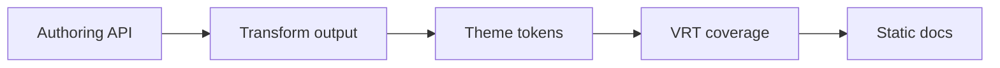

# Component Matrix

This matrix is the authoring contract for rich documentation pages built with
Ox Content. It covers the built-ins most likely to appear together in
production docs: callouts, details, tabs, package-manager tabs, file trees,
code annotations, code imports, math, Mermaid, embeds, search, and Code Play.

The examples below are live output from this docs site, not screenshots. Keep
this page in the default sidebar so visual regression tests can exercise the
same theme chrome, content column, and component styles readers use.

## Authoring Contracts

| Feature              | Authoring API                                      | Generated HTML and stable classes                                                                                  |
| -------------------- | -------------------------------------------------- | ------------------------------------------------------------------------------------------------------------------ |
| Callouts             | `> [!NOTE]` and related GitHub-style block quotes  | `<blockquote class="ox-callout ox-callout--note">` plus `.ox-callout-title`.                                       |
| Details blocks       | `::: details` / `::: details{open}`                | `<details class="ox-container ox-container--details">` with native `<summary>`.                                    |
| Custom containers    | `::: tip`, `::: warning`, `::: danger`, custom map | `<div class="ox-container ox-container--tip">` and `.ox-container-title`; custom names use `ox-container--<type>`. |
| Generic tabs         | `<tabs><tab label="...">...</tab></tabs>`          | `.ox-tabs-container`, `.ox-tabs`, `.ox-tabs-header`, radio inputs, labels, `.ox-tab-panel`, `.ox-tabs-fallback`.   |
| Package-manager tabs | `<pm>npm install pkg</pm>`                         | Same `.ox-tabs` widget; optional sync adds `data-ox-tab-group="pkg-manager"`.                                      |
| File trees           | ` ```file-tree ` fences                            | `.ox-file-tree`, `.ox-file-tree__dir`, `.ox-file-tree__file`, `.ox-file-tree__highlight`, `.ox-file-tree__icon`.   |
| Code annotations     | `annotate="..."`, VitePress meta, inline comments  | `.ox-code-block`, `.ox-code-line`, `data-line`, `data-line-number`, and semantic `ox-code-line--*` classes.        |
| Code imports         | `<<< @/path/file.ts{region}`                       | Imported source reuses normal highlighted/annotated code block output; no extra wrapper class.                     |
| Math                 | `$inline$` and `$$display$$`                       | `.ox-math.ox-math-inline` and `.ox-math.ox-math-block`; KaTeX output is build-time HTML when available.            |
| Mermaid              | ` ```mermaid ` fences                              | `.ox-mermaid` static SVG when `mmdc` is available; otherwise the original code block remains.                      |
| Embeds               | `<GitHub>`, `<OgCard>`, `<Bluesky>`, media tags    | `.ox-github-*`, `.ox-ogp-*`, `.ox-bluesky`, `.ox-tweet`, `.ox-youtube`, `.ox-audio`, `.ox-video`, media classes.   |
| Search               | `search` option and `virtual:ox-content/search`    | Default theme chrome emits `.search-button`, `.search-modal`, `.search-input`, `.search-results`.                  |
| Code Play            | ` ```js play ` or `<CodePlay>`                     | `<ox-code-play data-ox-code-play>` hydrates to `.ox-code-play`, `.ox-code-play__toolbar`, tabs, panels, status.    |

## Behavior Contracts

| Feature          | Accessibility behavior                                                                                                    | Theme hooks and runtime behavior                                                                                |
| ---------------- | ------------------------------------------------------------------------------------------------------------------------- | --------------------------------------------------------------------------------------------------------------- |
| Callouts         | Remain real block quotes with a visible title; body content keeps normal reading order.                                   | Use `.ox-callout` modifiers and `--octc-color-*`; no JavaScript.                                                |
| Details blocks   | Native disclosure semantics provide keyboard toggling, name from `<summary>`, and persistent open state in markup.        | Use container classes, border/background tokens, and no JavaScript.                                             |
| Tabs             | Radio/label controls are keyboard focusable; `<noscript>` renders all panels as native details.                           | Dynamic CSS uses `:has()` and stable `data-group`/`data-tab`; optional sync is the only client JavaScript.      |
| File trees       | Directories with children use native `<details>`/`<summary>`; icons are decorative and names are escaped.                 | `--octc-color-*` and file-tree classes; no JavaScript and no filesystem reads.                                  |
| Code blocks      | Line numbers are `data-line-number`; annotations are visual state on real text, not separate images.                      | `--octc-syntax-*`, `--octc-color-code-*`, and annotation tokens; highlighting is build-time.                    |
| Math and Mermaid | Rendered math and diagrams are static; fallback text remains present when optional renderers are unavailable.             | Math uses `.ox-math`; Mermaid uses `.ox-mermaid`; both avoid runtime libraries.                                 |
| Embeds           | Static cards are links/articles with escaped text; iframe/media embeds require titles, lazy loading, and safe URL checks. | Card/player classes plus component styles; third-party players are opt-in and lazy, static cards use no script. |
| Search           | Header button opens a dialog; input, locale/version selects, scoped results, and Escape close behavior are theme-owned.   | Local BM25 index is a static JSON asset fetched lazily; hosted search is opt-in and fails closed.               |
| Code Play        | Hydrated UI exposes a region label, polite status, `aria-busy`, action buttons, tablist, and tab panels.                  | Styles consume `--octc-*`; only pages with `play` samples load `ox-code-play.js`; samples run on demand.        |

## Live Matrix

### Callouts and Details

> [!NOTE]
> GitHub-style callouts are always rendered as block quotes with
> `.ox-callout` classes, so they work in static HTML and print output.

::: warning Review before publishing
Use callouts for interruptive content. Do not nest card grids inside callouts;
prefer plain prose, lists, tables, code, and one interactive component at a
time.
:::

::: details{open}
The details block uses native disclosure markup. With JavaScript disabled, the
summary still toggles from the keyboard and the open attribute keeps this
example expanded on first paint.
:::

### Tabs and Package Managers

<tabs>
<tab label="Authoring">
<pre><code>&lt;tabs&gt;
  &lt;tab label="Install"&gt;pnpm add -D @ox-content/vite-plugin&lt;/tab&gt;
  &lt;tab label="Config"&gt;oxContent({ srcDir: "content" })&lt;/tab&gt;
&lt;/tabs&gt;</code></pre>
</tab>
<tab label="Generated classes">
<pre><code>.ox-tabs-container
.ox-tabs
.ox-tabs-header
.ox-tab-panel[data-tab="0"]
.ox-tabs-fallback</code></pre>
</tab>
<tab label="No script">
The selected panel is CSS-driven. The noscript fallback renders every panel as a
native disclosure.
</tab>
</tabs>

<pm>npm install -D @ox-content/vite-plugin @ox-content/code-play</pm>

### File Tree

```file-tree
- docs/
  - content/
    - built-in/
      - component-matrix.md **
      - code-blocks.md
      - embeds.md
  - vite.config.ts
- npm/
  - vite-plugin-ox-content/
    - test/
      - vrt/
        - component-matrix.spec.ts **
```

### Code Annotations and Imports

```ts annotate="highlight:1,8;warning:4;error:5"
export function resolveComponentContract(name: string) {
  const contract = name.trim();
  if (!contract) {
    console.warn("missing component contract");
    throw new Error("component contract is required");
  }
  return `ox-${contract}`;
}
```

<<< @/snippets/greet.ts{greet}

::: code-group

```ts [vite.config.ts]
import { oxContent } from "@ox-content/vite-plugin";

export default {
  plugins: [
    oxContent({
      highlight: true,
      codeAnnotations: { notation: "both" },
      codeImports: true,
    }),
  ],
};
```

````md [page.md]
```ts annotate="highlight:1"
export const documented = true;
```
````

:::

### Math and Mermaid

Inline budget expression: $T_{page}=T_{parse}+T_{render}+T_{widgets}$.

$$
T_{docs}=T_{markdown}+T_{static\ embeds}+T_{lazy\ runtime}
$$



### Embeds

<Bluesky url="https://bsky.app/profile/bsky.app/post/3l6oveex3ii2l" displayName="Bluesky" handle="bsky.app" dateTime="2024-02-06T12:34:56Z" dateLabel="Feb 6, 2024" replies="12" reposts="34" likes="56">Static social cards keep author-supplied text in first-party HTML.</Bluesky>

<figure>
<audio class="ox-audio" controls preload="metadata" src="data:audio/mpeg;base64," aria-label="Intro audio"></audio>
<figcaption><span class="ox-av-title">Intro audio</span><a class="ox-av-transcript" href="#embeds">Transcript</a><a class="ox-av-download" href="#embeds" download>Download</a></figcaption>
</figure>

### Search

Search is a site-level authoring feature rather than inline Markdown syntax.
The default theme exposes it through the header and custom UIs use the same
virtual module:

```ts
import { search, searchOptions } from "virtual:ox-content/search";

const results = await search("component matrix", { limit: 5 });
console.log(
  searchOptions.enabled,
  results.map((item) => item.title),
);
```

Readers can press <kbd>/</kbd> or the theme's search shortcut, and scoped
queries such as `@built-in code play` restrict results to a section.

### Code Play

```js play play-title="Matrix JavaScript smoke"
const feature = "component matrix";
console.log(feature);
```

## Combination Checks

::: details{open}
<pm>npm install -D @ox-content/vite-plugin @ox-content/code-play</pm>

<tabs>
<tab label="Review">
Details containing tabs exercise disclosure layout and tab panel spacing.
</tab>
<tab label="Ship">
Package-manager tabs stay adjacent to manual tabs so the content column does not
create nested card grids.
</tab>
</tabs>
:::

::: tip Reference recipe
Keep reference pages scannable: a callout introduces intent, a file tree shows
where source lives, and an annotated code block names the exact line state.
:::

```file-tree
- reference/
  - api.md **
  - examples/
    - code-play.md
```

```ts:line-numbers=20 {2} [reference.ts]
export function renderReferencePage() {
  return "stable classes, static output, lazy runtime";
}
```

## Audit Follow-ups

| Area                | Result                                                                                                                                                                         | Follow-up tracking                      |
| ------------------- | ------------------------------------------------------------------------------------------------------------------------------------------------------------------------------ | --------------------------------------- |
| MDX/component paths | GA-readiness coverage is already tracked and closed.                                                                                                                           | #852                                    |
| Code Play           | This page specifies the page-level contract; runtime polish is already tracked/closed.                                                                                         | #856                                    |
| Theme packages      | Default and dense-theme behavior is exercised by VRT; theme quality is tracked/closed.                                                                                         | #858                                    |
| Embeds catalog      | Static cards are exercised live. Native media player output is shown with generated HTML because plain `.md` downcases `<Audio>` / `<Video>` before the PascalCase embed pass. | #861                                    |
| Performance budget  | This slice adds docs/VRT only and keeps build-time transforms plus lazy runtime loading.                                                                                       | Compatible with the closed #851 budget. |

No new duplicate implementation issue was filed from this audit. The remaining
tracked implementation work is the existing embed catalog follow-up in #861.
