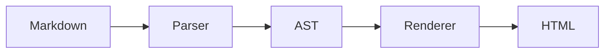
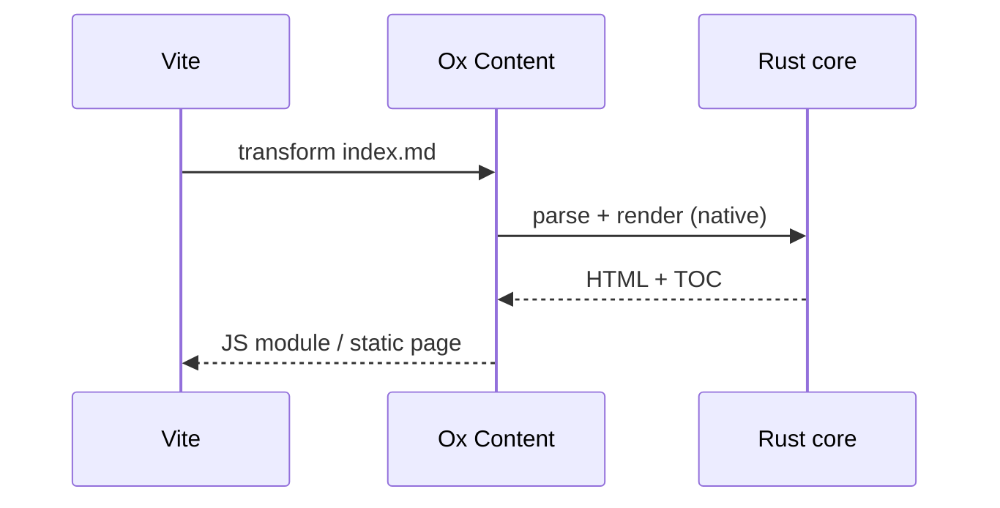

# Mermaid Diagrams

Mermaid rendering is opt-in:

```ts
import { oxContent } from "@ox-content/vite-plugin";

export default {
  plugins: [
    oxContent({
      mermaid: true,
    }),
  ],
};
```

When enabled, ` ```mermaid ` fences are rendered to inline SVG during the
build — readers get a static image, not a runtime library. The heavy lifting
happens once at build time instead of in every visitor's browser.

## Rendered Example

````md

````


Any diagram type mermaid supports works the same way:

````md

````


## Requirements

Rendering shells out to the mermaid CLI (`mmdc`), so add it as a dev
dependency:

<pm>npm install -D @mermaid-js/mermaid-cli</pm>

If `mmdc` cannot be found, the build does not fail: mermaid fences are left as
code blocks and a warning is printed once. This keeps CI images without the
CLI (or without a headless browser) working while you decide whether diagrams
are worth the dependency.

## Related

- [Embeds](./embeds.md) — other tags that expand to static HTML at build time.
- [Built-in Features overview](../built-in-features.md)
