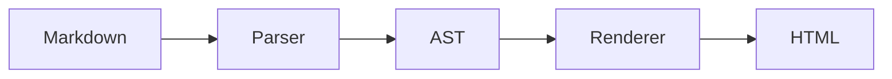
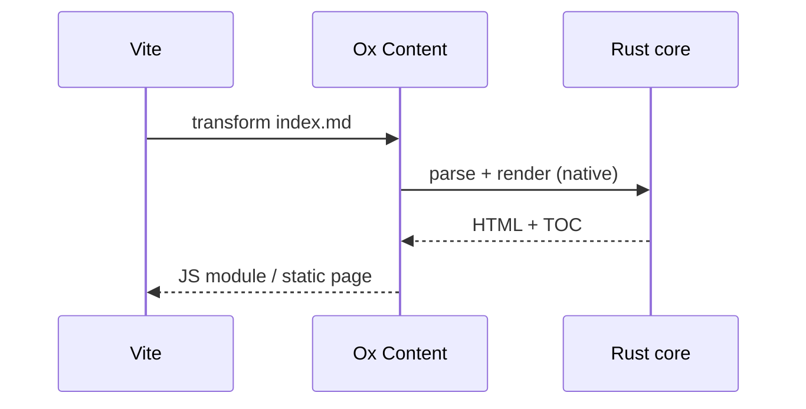

# Mermaid Diagrams

Mermaid rendering is opt-in:

```ts
import { oxContent } from "@ox-content/vite-plugin";

export default {
  plugins: [
    oxContent({
      mermaid: true,
    }),
  ],
};
```

When enabled, ` ```mermaid ` fences are rendered to inline SVG during the
build — readers get a static image, not a runtime library. The heavy lifting
happens once at build time instead of in every visitor's browser.

## Rendered Example

````md

```mermaid
flowchart LR
  Markdown --> Parser
  Parser --> AST
  AST --> Renderer
  Renderer --> HTML
```
````


```mermaid
flowchart LR
  Markdown --> Parser
  Parser --> AST
  AST --> Renderer
  Renderer --> HTML
```

Any diagram type mermaid supports works the same way:

````md

```mermaid
sequenceDiagram
  participant V as Vite
  participant O as Ox Content
  participant R as Rust core
  V->>O: transform index.md
  O->>R: parse + render (native)
  R-->>O: HTML + TOC
  O-->>V: JS module / static page
```
````


```mermaid
sequenceDiagram
  participant V as Vite
  participant O as Ox Content
  participant R as Rust core
  V->>O: transform index.md
  O->>R: parse + render (native)
  R-->>O: HTML + TOC
  O-->>V: JS module / static page
```

## Requirements

The plugin includes a Mermaid SVG renderer. Install its headless browser when
your environment does not already provide one:

<pm>npx puppeteer browsers install chrome-headless-shell</pm>

Set `PUPPETEER_EXECUTABLE_PATH` to use an existing Chrome installation. Standard
Mermaid diagrams work without installing `mmdc`. For additional CLI integrations,
including ZenUML, install `@mermaid-js/mermaid-cli` in your project; Ox Content
prefers that renderer when available.

When rendering fails, the original code block remains and the build prints a warning.

## Related

- [Embeds](./embeds.md) — other tags that expand to static HTML at build time.
- [Built-in Features overview](../built-in-features.md)
