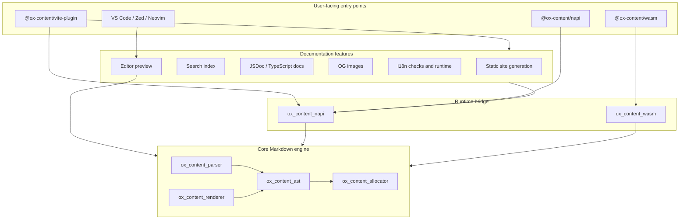
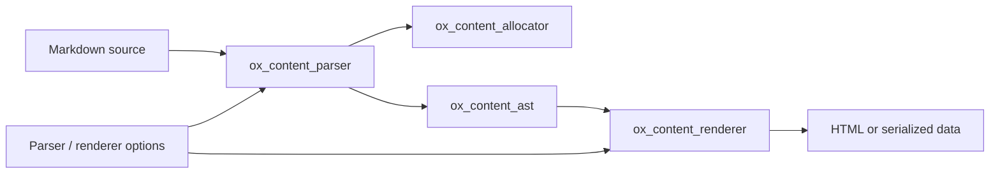
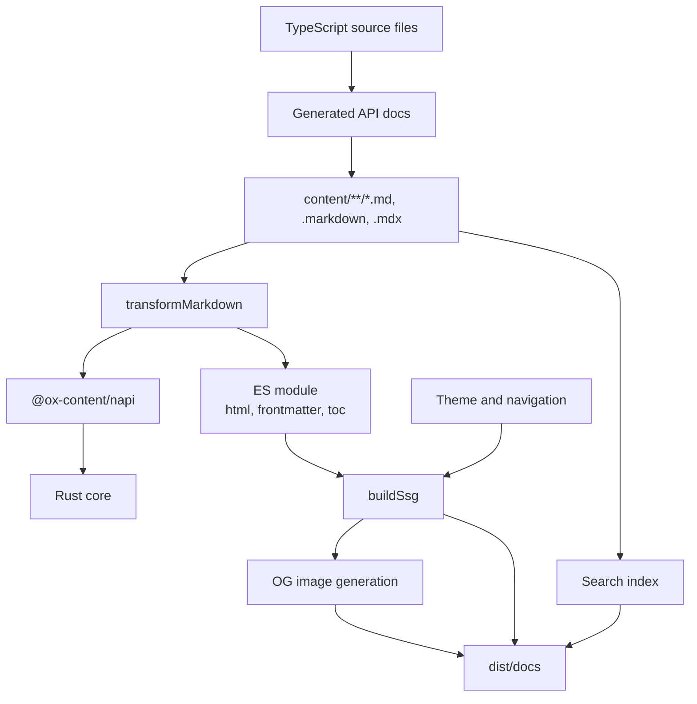
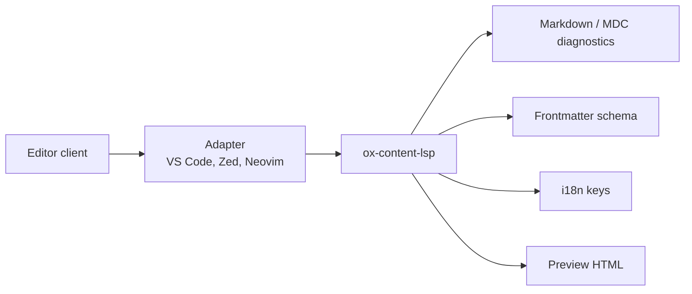

# アーキテクチャ

Ox Content は、Rust 製のドキュメントシステムと Markdown ツールキットです。
コアエンジンは小さく、Markdown を arena 割り当てされた AST にパースし、それから描画または
直列化します。リポジトリの残りは、そのエンジンを Vite、Node.js、
WebAssembly、生成 API ドキュメント、検索、OG 画像、i18n、エディタツール向けにパッケージしています。

このページは地図です。大きな境界が見えるよう、API リファレンスの詳細と
性能結果は意図的に避けています。

## いまの形

Ox Content には 3 つの層があります。

1. **コア Markdown エンジン**: 割り当て、AST ノード、パース、描画向けの Rust crate。
2. **プロダクト機能**: SSG、検索、生成 API ドキュメント、埋め込み、OG 画像、i18n チェック、
   エディタプレビュー向けの Rust と TypeScript モジュール。
3. **配布面**: npm パッケージ、N-API バインディング、WebAssembly、Vite
   プラグイン、フレームワーク連携、エディタアダプター。

大事な区別は、パーサーがプロダクト全体ではないことです。パーサーは、docs サイト、
パッケージ API、執筆ツール、チェックが使ういちばん下の層です。

## 入口

| 入口                             | 用途                                                                                 | 主な実装                                               |
| -------------------------------- | ------------------------------------------------------------------------------------ | ------------------------------------------------------ |
| `@ox-content/vite-plugin`        | ドキュメントサイト、Markdown 変換、SSG、テーマ、検索、OG 画像、生成 API ドキュメント | TypeScript のオーケストレーションと `@ox-content/napi` |
| `@ox-content/napi`               | Node.js スクリプト、独自ツール、直接の parse/render/search/docs API                  | `crates/ox_content_napi`                               |
| `@ox-content/wasm`               | ブラウザ、Web Worker、またはサンドボックス化された JavaScript ホスト                 | `crates/ox_content_wasm`                               |
| `@ox-content/vite-plugin-vue`    | Markdown 内の Vue コンポーネント island                                              | ベース Vite プラグインと Vue ランタイム                |
| `@ox-content/vite-plugin-react`  | Markdown 内の React コンポーネント island                                            | ベース Vite プラグインと React ランタイム              |
| `@ox-content/vite-plugin-svelte` | Markdown 内の Svelte コンポーネント island                                           | ベース Vite プラグインと Svelte ランタイム             |
| `@ox-content/vite-plugin-solid`  | Markdown 内の Solid コンポーネント island                                            | ベース Vite プラグインと Solid ランタイム              |
| `@ox-content/unplugin`           | Rollup、webpack、esbuild など Vite 以外のバンドラー                                  | 汎用プラグインラッパー                                 |
| エディタ連携                     | 補完、診断、スニペット、プレビュー、i18n 執筆                                        | `ox-content-lsp` とエディタアダプター                  |

ほとんどのドキュメントプロジェクトでは、Vite プラグインから始めてください。必要なネイティブパッケージは
すでに依存しているので、`@ox-content/napi` を直接入れるのは、独自の Node.js ツールを作るときだけが普通です。

## Markdown エンジン

コアの Markdown 経路は意図して狭いです。

主な性質:

- 各パース操作は `Allocator` を所有し、通常は入力長からサイズを決めます。
- AST ノードはソーステキストと arena から借用するので、パースは速く、
  不要な文字列コピーを避けます。
- 描画は、Node.js、WebAssembly、ブラウザへ渡る前に、HTML、JSON データ、JavaScript モジュール
  コードのような所有出力を作ります。
- パーサーオプションは GFM、脚注、表、タスクリスト、取り消し線、
  自動リンク、入れ子上限を制御します。
- レンダラーオプションは、`.md` リンク変換、ベース URL、行注釈、
  コードブロックメタデータ、TOC の深さといったドキュメントサイトの振る舞いを足します。

## Vite と SSG パイプライン

Vite プラグインが主なプロダクト面です。開発中は Markdown 風ファイルを import 可能なモジュールにし、
ビルド中は静的 HTML にします。

開発中、Markdown の import はモジュールへ変換され、変更ファイル向けに HMR が
`ox-content:update` イベントを送ります。ビルド中、SSG ステップは
Markdown ファイルを集め、ルートを解決し、ナビを組み立て、HTML ページを生成し、
検索インデックスを書き、任意でページごとの OG 画像を生成します。

docs ジェネレーターは同じビルドグラフの一部です。TypeScript/JSDoc
メタデータを抽出し、サイトビルドが消費する前に、設定した docs 出力ディレクトリへ
Markdown ファイルを書きます。

## Rust crate

| 層                 | crate                                                                                | 責任                                                               |
| ------------------ | ------------------------------------------------------------------------------------ | ------------------------------------------------------------------ |
| コア Markdown      | `ox_content_allocator`、`ox_content_ast`、`ox_content_parser`、`ox_content_renderer` | arena ベースのデータ構造で Markdown をパースして描画する           |
| ランタイムブリッジ | `ox_content_napi`、`ox_content_wasm`、`ox_content_vite`                              | コアを Node.js、WebAssembly、Vite 向けランタイムコードへ公開する   |
| サイト機能         | `ox_content_ssg`、`ox_content_search`、`ox_content_docs`、`ox_content_og_image`      | 静的ページ、検索データ、ソースドキュメント、画像アセットを生成する |
| 執筆チェック       | `ox_content_i18n`、`ox_content_i18n_checker`、`ox_content_mdc_checker`               | 辞書、翻訳キー使用、MDC コンポーネント構文を検証する               |
| 言語サーバー       | `ox_content_lsp`、`ox_content_i18n_lsp`                                              | 補完、診断、プレビュー、i18n 執筆機能を提供する                    |
| プロファイリング   | `ox_content_profiler`、`ox_content_profile_cli`                                      | パーサーとレンダラー作業の割り当てとタイミングスパンを測る         |
| CLI                | `ox_content_i18n_cli`、`ox_content_profile_cli`、`ox_content_mdc_checker`            | Vite プラグインの外でチェックとプロファイリングを実行する          |

crate はひとつの Cargo ワークスペースから公開されます。内部依存は
ワークスペースバージョンとローカルパスを使うので、個別 crate を公開しつつ、
リポジトリをひとつのシステムとして開発できます。

## JavaScript パッケージ

| パッケージ                       | 役割                                                                                                    |
| -------------------------------- | ------------------------------------------------------------------------------------------------------- |
| `@ox-content/napi`               | `ox_content_napi` とプラットフォームバインディングパッケージに裏打ちされたネイティブ Node.js パッケージ |
| `@ox-content/vite-plugin`        | メインの Vite プラグインと公開 TypeScript API                                                           |
| `@ox-content/vite-plugin-vue`    | Vue island ランタイムと transform 連携                                                                  |
| `@ox-content/vite-plugin-react`  | React island ランタイムと transform 連携                                                                |
| `@ox-content/vite-plugin-svelte` | Svelte island ランタイムと transform 連携                                                               |
| `@ox-content/vite-plugin-solid`  | Solid island ランタイムと transform 連携                                                                |
| `@ox-content/islands`            | フレームワーク非依存の island 登録とハイドレーション基盤                                                |
| `@ox-content/code-play`          | オプトインのオンデマンドサンプル実行、型チェック、ビューアー                                            |
| `@ox-content/unplugin`           | 汎用バンドラープラグインラッパー                                                                        |
| `vscode-ox-content`              | ローカル LSP サーバーと話す VS Code 拡張                                                                |

フレームワークパッケージはベースプラグインを置き換えず、包みます。そのため
Markdown パース、SSG、検索、生成ドキュメント、テーマの振る舞いは
`@ox-content/vite-plugin` に集中したままです。

## 執筆ツール

エディタ連携は、統合言語サーバーを中心に組み立てています。

LSP はサイトパイプラインと同じパーサーとレンダラーの概念を共有しますが、
出力は執筆向けに最適化されています。診断、スニペット、補完、
定義ジャンプ、ホバー、インレイヒント、プレビュー HTML です。
対応するチェッカー / LSP 機能と既知のギャップは
[チェッカーと言語サーバー](./packages/lsp.md) にあります。

## 境界と不変条件

- **パースの正しさは Rust が所有します。** JavaScript のオーケストレーションは、
  Markdown の振る舞いを再実装せず、N-API または WASM を呼ぶべきです。
- **連携の形は TypeScript が所有します。** Vite プラグイン、仮想モジュール、
  フレームワークアダプター、dev サーバーの振る舞いは npm パッケージにあります。
- **生成サイト機能はビルド時が先です。** 検索、GitHub カード、Open
  Graph カード、ソースドキュメント、OG 画像は、可能なところでは静的に生成します。
- **エディタ機能は同じドメインモデルを再利用します。** 診断とプレビューは
  パーサー、レンダラー、frontmatter、MDC、i18n crate と揃ったままであるべきです。
- **ランタイムをまたぐデータは所有されます。** 借用された AST データは Rust 内に留まります。
  JSON、HTML、またはモジュールコードがランタイム境界を越えます。

## 次に読む

- [はじめる](./getting-started.md) は適切な入口を選びます。
- [@ox-content/vite-plugin](./packages/vite-plugin-ox-content.md) は
  サイトと transform API を文書化しています。
- [パフォーマンス](./performance.md) にはベンチマーク結果と再現
  コマンドがあります。
- [@ox-content/napi](./packages/napi.md) は Node.js API を文書化しています。
- [@ox-content/wasm](./packages/wasm.md) はブラウザと WebAssembly の使い方を扱います。
- [開発環境のセットアップ](./development-setup.md) はローカルビルド、
  コントリビューター向けコマンド、テストワークフローを説明します。
- [Panic 防止](./panic-prevention.md) は入力起因 panic の #774 証拠台帳です。
