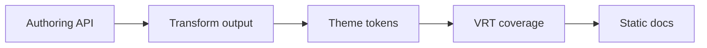

# コンポーネントマトリクス

このページは、Ox Content でリッチなドキュメントを書くときの組み込み機能の契約です。対象は、callout、details、タブ、パッケージマネージャータブ、ファイルツリー、コード注釈、コード取り込み、数式、Mermaid、埋め込み、検索、Code Play です。

下の例はこの docs サイトで実際に描画される出力です。既定テーマのサイドバーに置くことで、読者が見るテーマ chrome、本文カラム、コンポーネント CSS を VRT でも同じように検証できます。

## 執筆契約

| 機能                       | 執筆 API                                             | 生成 HTML と安定 class                                                                                            |
| -------------------------- | ---------------------------------------------------- | ----------------------------------------------------------------------------------------------------------------- |
| Callout                    | `> [!NOTE]` 系の GitHub 風 blockquote                | `<blockquote class="ox-callout ox-callout--note">` と `.ox-callout-title`。                                       |
| Details                    | `::: details` / `::: details{open}`                  | `<details class="ox-container ox-container--details">` とネイティブ `<summary>`。                                 |
| カスタムコンテナ           | `::: tip`、`::: warning`、独自 map                   | `<div class="ox-container ox-container--tip">` と `.ox-container-title`。独自名は `ox-container--<type>`。        |
| 汎用タブ                   | `<tabs><tab label="...">...</tab></tabs>`            | `.ox-tabs-container`、`.ox-tabs`、`.ox-tabs-header`、radio、label、`.ox-tab-panel`、`.ox-tabs-fallback`。         |
| パッケージマネージャータブ | `<pm>npm install pkg</pm>`                           | 同じ `.ox-tabs`。同期を有効にすると `data-ox-tab-group="pkg-manager"`。                                           |
| ファイルツリー             | ` ```file-tree ` fence                               | `.ox-file-tree`、`.ox-file-tree__dir`、`.ox-file-tree__file`、`.ox-file-tree__highlight`、`.ox-file-tree__icon`。 |
| コード注釈                 | `annotate="..."`、VitePress meta、インラインコメント | `.ox-code-block`、`.ox-code-line`、`data-line`、`data-line-number`、`ox-code-line--*`。                           |
| コード取り込み             | `<<< @/path/file.ts{region}`                         | 通常のハイライト済みコードブロックとして出力。専用 wrapper はありません。                                         |
| 数式                       | `$inline$` と `$$display$$`                          | `.ox-math.ox-math-inline` と `.ox-math.ox-math-block`。KaTeX があればビルド時 HTML。                              |
| Mermaid                    | ` ```mermaid ` fence                                 | `mmdc` があれば `.ox-mermaid` の静的 SVG。なければ元のコードブロック。                                            |
| 埋め込み                   | `<GitHub>`、`<OgCard>`、`<Bluesky>`、media tag       | `.ox-github-*`、`.ox-ogp-*`、`.ox-bluesky`、`.ox-tweet`、`.ox-youtube`、`.ox-audio`、`.ox-video` など。           |
| 検索                       | `search` option と `virtual:ox-content/search`       | 既定テーマは `.search-button`、`.search-modal`、`.search-input`、`.search-results` を出します。                   |
| Code Play                  | ` ```js play ` または `<CodePlay>`                   | `<ox-code-play data-ox-code-play>` が `.ox-code-play`、toolbar、tabs、panels、status に hydrate します。          |

## 振る舞いの契約

| 機能           | アクセシビリティ                                                                                | テーマと実行時                                                                                           |
| -------------- | ----------------------------------------------------------------------------------------------- | -------------------------------------------------------------------------------------------------------- |
| Callout        | 実体は blockquote のままで、タイトルと本文の読み上げ順を保ちます。                              | `.ox-callout` と `--octc-color-*`。JavaScript 不要。                                                     |
| Details        | ネイティブ disclosure なので、キーボード操作、summary 名、`open` 属性がそのまま効きます。       | コンテナ class と border/background token。JavaScript 不要。                                             |
| タブ           | radio/label がフォーカス可能で、`<noscript>` では全パネルを details として表示します。          | `:has()` と `data-group` / `data-tab`。同期だけが任意のクライアント JS。                                 |
| ファイルツリー | 子を持つディレクトリは `<details>` / `<summary>`。アイコンは装飾で、名前は escape されます。    | ファイルツリー class と `--octc-color-*`。JavaScript 不要で実 filesystem も読みません。                  |
| コード         | 行番号は `data-line-number`。注釈は画像ではなくテキスト行への視覚状態です。                     | `--octc-syntax-*`、`--octc-color-code-*`、注釈 token。ハイライトはビルド時。                             |
| 数式と Mermaid | 数式と図は静的出力。任意 renderer がない場合も fallback テキストが残ります。                    | `.ox-math` と `.ox-mermaid`。runtime library は読みません。                                              |
| 埋め込み       | 静的カードは link/article、iframe/media は title、lazy loading、安全な URL 検査を前提にします。 | 各 component class と公式 CSS。サードパーティ player は opt-in かつ lazy、静的カードは no script。       |
| 検索           | header button から dialog を開き、input/select/results/Escape の挙動はテーマが所有します。      | BM25 index は静的 JSON を初回検索時に lazy fetch。hosted search は opt-in で fail closed。               |
| Code Play      | region label、polite status、`aria-busy`、action button、tablist、tabpanel を出します。         | `--octc-*` を使い、`play` sample があるページだけ `ox-code-play.js` を読みます。実行はオンデマンドです。 |

## ライブマトリクス

### Callouts and Details

> [!NOTE]
> GitHub 風 callout は `.ox-callout` class 付きの blockquote として出力され、静的 HTML と印刷で動きます。

::: warning 公開前レビュー
割り込み要素は callout に留めます。callout の中に card grid を重ねず、本文、リスト、表、コード、単一のインタラクティブ要素を優先します。
:::

::: details{open}
Details はネイティブ disclosure です。JavaScript がなくても summary はキーボードで切り替えられ、`open` 属性で初期表示を制御できます。
:::

### Tabs and Package Managers

<tabs>
<tab label="Authoring">
<pre><code>&lt;tabs&gt;
  &lt;tab label="Install"&gt;pnpm add -D @ox-content/vite-plugin&lt;/tab&gt;
  &lt;tab label="Config"&gt;oxContent({ srcDir: "content" })&lt;/tab&gt;
&lt;/tabs&gt;</code></pre>
</tab>
<tab label="Generated classes">
<pre><code>.ox-tabs-container
.ox-tabs
.ox-tabs-header
.ox-tab-panel[data-tab="0"]
.ox-tabs-fallback</code></pre>
</tab>
<tab label="No script">
選択中パネルは CSS で切り替わります。noscript fallback は全パネルをネイティブ details として出します。
</tab>
</tabs>

<pm>npm install -D @ox-content/vite-plugin @ox-content/code-play</pm>

### File Tree

```file-tree
- docs/
  - content/
    - built-in/
      - component-matrix.md **
      - code-blocks.md
      - embeds.md
  - vite.config.ts
- npm/
  - vite-plugin-ox-content/
    - test/
      - vrt/
        - component-matrix.spec.ts **
```

### Code Annotations and Imports

```ts annotate="highlight:1,8;warning:4;error:5"
export function resolveComponentContract(name: string) {
  const contract = name.trim();
  if (!contract) {
    console.warn("missing component contract");
    throw new Error("component contract is required");
  }
  return `ox-${contract}`;
}
```

<<< @/snippets/greet.ts{greet}

::: code-group

```ts [vite.config.ts]
import { oxContent } from "@ox-content/vite-plugin";

export default {
  plugins: [
    oxContent({
      highlight: true,
      codeAnnotations: { notation: "both" },
      codeImports: true,
    }),
  ],
};
```

````md [page.md]
```ts annotate="highlight:1"
export const documented = true;
```
````

:::

### Math and Mermaid

Inline budget expression: $T_{page}=T_{parse}+T_{render}+T_{widgets}$.

$$
T_{docs}=T_{markdown}+T_{static\ embeds}+T_{lazy\ runtime}
$$



### Embeds

<Bluesky url="https://bsky.app/profile/bsky.app/post/3l6oveex3ii2l" displayName="Bluesky" handle="bsky.app" dateTime="2024-02-06T12:34:56Z" dateLabel="Feb 6, 2024" replies="12" reposts="34" likes="56">Static social cards keep author-supplied text in first-party HTML.</Bluesky>

<figure>
<audio class="ox-audio" controls preload="metadata" src="data:audio/mpeg;base64," aria-label="Intro audio"></audio>
<figcaption><span class="ox-av-title">Intro audio</span><a class="ox-av-transcript" href="#embeds">Transcript</a><a class="ox-av-download" href="#embeds" download>Download</a></figcaption>
</figure>

### Search

検索は inline Markdown ではなく、サイト単位の執筆機能です。既定テーマは header に検索 UI を出し、独自 UI は同じ virtual module を使います。

```ts
import { search, searchOptions } from "virtual:ox-content/search";

const results = await search("component matrix", { limit: 5 });
console.log(
  searchOptions.enabled,
  results.map((item) => item.title),
);
```

読者は <kbd>/</kbd> やテーマの検索ショートカットを使えます。`@built-in code play` のような scoped query は検索範囲を絞ります。

### Code Play

```js play play-title="Matrix JavaScript smoke"
const feature = "component matrix";
console.log(feature);
```

## 組み合わせ確認

::: details{open}
<pm>npm install -D @ox-content/vite-plugin @ox-content/code-play</pm>

<tabs>
<tab label="Review">
Details の中の tabs で disclosure layout と tab panel spacing を確認します。
</tab>
<tab label="Ship">
Package-manager tabs は manual tabs と隣接させ、content column に nested card grid を作りません。
</tab>
</tabs>
:::

::: tip Reference recipe
参照ページは scannable に保ちます。callout で意図を示し、file tree で位置を示し、annotated code block で行状態を示します。
:::

```file-tree
- reference/
  - api.md **
  - examples/
    - code-play.md
```

```ts:line-numbers=20 {2} [reference.ts]
export function renderReferencePage() {
  return "stable classes, static output, lazy runtime";
}
```

## 監査フォローアップ

| 領域               | 結果                                                                                                                                                                            | 追跡                               |
| ------------------ | ------------------------------------------------------------------------------------------------------------------------------------------------------------------------------- | ---------------------------------- |
| MDX/component 経路 | GA-ready coverage は既に追跡され、closed です。                                                                                                                                 | #852                               |
| Code Play          | このページでページ単位の契約を明記し、runtime polish は追跡済み/closed です。                                                                                                   | #856                               |
| Theme packages     | 既定テーマと dense theme を VRT で扱い、theme quality は追跡済み/closed です。                                                                                                  | #858                               |
| Embeds catalog     | 静的カードは live で確認します。native media player 出力は、plain `.md` が `<Audio>` / `<Video>` を PascalCase embed pass の前に downcase するため、generated HTML で示します。 | #861                               |
| Performance budget | この slice は docs/VRT のみで、build-time transform と lazy runtime loading を保ちます。                                                                                        | closed #851 の budget と互換です。 |

この監査から重複する新規 implementation issue は作成していません。残る実装作業は既存の embed catalog follow-up #861 です。
