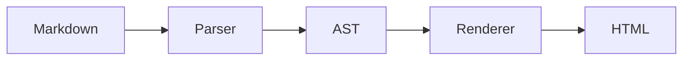

# Mermaid

描画はオプトインです。

```ts
oxContent({
  mermaid: true,
});
```

有効にすると ` ```mermaid ` フェンスがビルド中にインライン SVG になります。読者には静的画像が渡り、実行時ライブラリは付きません。重い処理は訪問者のブラウザではなく、ビルド一度だけです。

````md

````

省略または `false` ではフェンスはふつうのコードブロックです。

## 関連

- [英語版ガイド](/built-in/mermaid.md)
