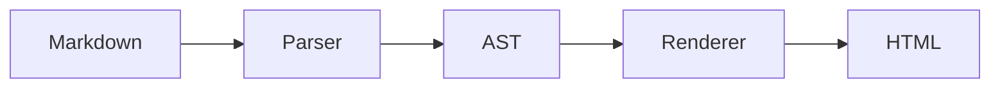
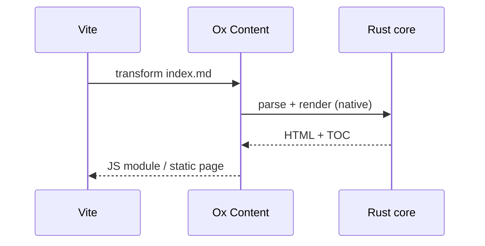

# Mermaid 図

Mermaid 描画はオプトインです。

```ts
import { oxContent } from "@ox-content/vite-plugin";

export default {
  plugins: [
    oxContent({
      mermaid: true,
    }),
  ],
};
```

有効にすると、```` mermaid ```` フェンスはビルド中にインライン SVG へ描画されます。
読者はランタイムライブラリではなく静的画像を得ます。重い処理は
訪問者のブラウザではなく、ビルド時に一度だけ行われます。

## 描画例

````md

````


mermaid が対応するどの図の種類も同じように動きます。

````md

````


## 要件

描画は mermaid CLI（`mmdc`）を外に出すので、dev
依存として追加してください。

<pm>npm install -D @mermaid-js/mermaid-cli</pm>

`mmdc` が見つからないとき、ビルドは失敗しません。mermaid フェンスはコードブロックのまま残り、
警告が一度だけ出ます。図の依存が必要かどうかを決めるあいだ、
CLI（またはヘッドレスブラウザ）のない CI イメージも動き続けます。

## 関連

- [埋め込み](./embeds.md) — ビルド時に静的 HTML へ展開する他のタグ。
- [組み込み機能の概要](../built-in-features.md)
