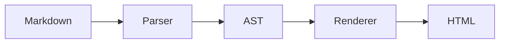
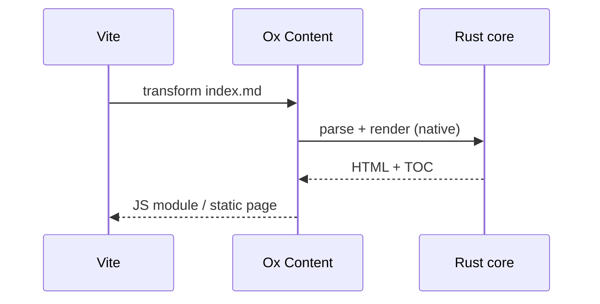

# Mermaid

Mermaid の描画はオプトインです。

```ts
import { oxContent } from "@ox-content/vite-plugin";

export default {
  plugins: [
    oxContent({
      mermaid: true,
    }),
  ],
};
```

有効にすると、` ```mermaid ` フェンスはビルド中にインライン SVG へ描画されます。読者が得るのは静的画像であり、実行時ライブラリではありません。重い処理は訪問者のブラウザではなく、ビルド時に一度だけ走ります。

## 描画例

````md

````


mermaid が対応する図の種類は、どれも同じように動きます。

````md

````


## 要件

描画は mermaid CLI（`mmdc`）を起動するので、開発依存として足してください。

<pm>npm install -D @mermaid-js/mermaid-cli</pm>

`mmdc` が見つからなくてもビルドは失敗しません。mermaid フェンスはコードブロックのまま残り、警告を一度だけ出します。CLI（またはヘッドレスブラウザ）のない CI イメージでも動き続け、図の依存を足すかどうかを後から決められます。

## 関連

- [埋め込み](./embeds.md) — ビルド時に静的 HTML へ展開する、その他のタグ。
- [組み込み機能の一覧](../built-in-features.md)
