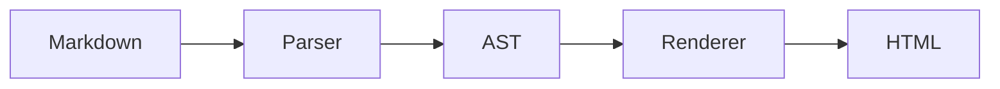
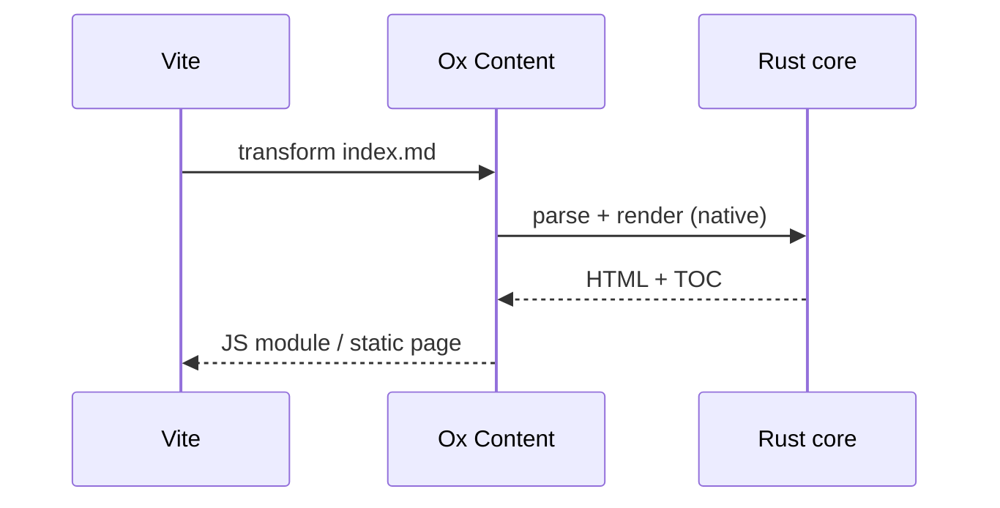

# Mermaid

Mermaid の描画はオプトインです。

```ts
import { oxContent } from "@ox-content/vite-plugin";

export default {
  plugins: [
    oxContent({
      mermaid: true,
    }),
  ],
};
```

有効にすると、` ```mermaid ` フェンスはビルド中にインライン SVG へ描画されます。読者が得るのは静的画像であり、実行時ライブラリではありません。重い処理は訪問者のブラウザではなく、ビルド時に一度だけ走ります。

## 描画例

````md

```mermaid
flowchart LR
  Markdown --> Parser
  Parser --> AST
  AST --> Renderer
  Renderer --> HTML
```
````


```mermaid
flowchart LR
  Markdown --> Parser
  Parser --> AST
  AST --> Renderer
  Renderer --> HTML
```

mermaid が対応する図の種類は、どれも同じように動きます。

````md

```mermaid
sequenceDiagram
  participant V as Vite
  participant O as Ox Content
  participant R as Rust core
  V->>O: transform index.md
  O->>R: parse + render (native)
  R-->>O: HTML + TOC
  O-->>V: JS module / static page
```
````


```mermaid
sequenceDiagram
  participant V as Vite
  participant O as Ox Content
  participant R as Rust core
  V->>O: transform index.md
  O->>R: parse + render (native)
  R-->>O: HTML + TOC
  O-->>V: JS module / static page
```

## 要件

プラグインには Mermaid の SVG レンダラーが含まれています。環境にブラウザがない場合は、ヘッドレスブラウザをインストールしてください。

<pm>npx puppeteer browsers install chrome-headless-shell</pm>

既存の Chrome を使う場合は `PUPPETEER_EXECUTABLE_PATH` を指定します。標準の Mermaid 図は `mmdc` なしで描画できます。ZenUML など CLI の追加統合が必要な場合は、プロジェクトに `@mermaid-js/mermaid-cli` をインストールしてください。利用できる場合は、そのレンダラーを優先します。

描画に失敗した場合は、元のコードブロックを残して警告を出します。

## 関連

- [埋め込み](./embeds.md) — ビルド時に静的 HTML へ展開する、その他のタグ。
- [組み込み機能の一覧](../built-in-features.md)
